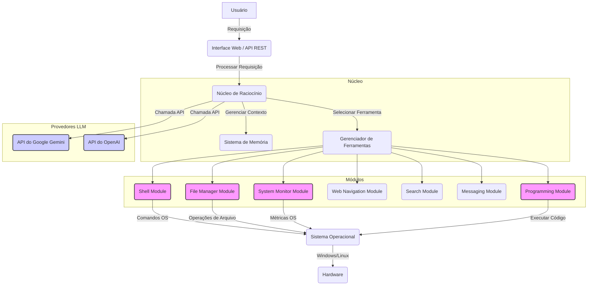

# Arquitetura Proposta para o Agente Autônomo

## Introdução

Este documento detalha a arquitetura proposta para um agente autônomo multifuncional, inspirado nas capacidades do Manus. O objetivo é criar um sistema robusto e flexível, capaz de interagir com o ambiente digital de forma inteligente, executando tarefas complexas que vão desde a manipulação de arquivos e navegação web até a construção e teste de software. A arquitetura será modular, permitindo a fácil expansão e integração de novas funcionalidades no futuro.

## Componentes Principais

A arquitetura do agente será composta por diversos módulos interconectados, cada um com responsabilidades específicas. A seguir, são apresentados os componentes principais:

### 1. Núcleo de Raciocínio (Reasoning Core)

O Núcleo de Raciocínio é o cérebro do agente, responsável por interpretar as requisições do usuário, planejar as ações necessárias para atingir os objetivos e coordenar a execução dessas ações. Ele utilizará um Grande Modelo de Linguagem (LLM) como base para suas capacidades cognitivas, permitindo a compreensão de linguagem natural, raciocínio complexo e tomada de decisões. Frameworks como LangChain ou LangGraph serão considerados para orquestrar as interações do LLM com as ferramentas disponíveis.

**Funcionalidades:**
*   **Interpretação de Requisições:** Analisar e compreender as instruções do usuário, convertendo-as em objetivos claros e acionáveis.
*   **Planejamento de Tarefas:** Gerar um plano de execução detalhado, dividindo objetivos complexos em subtarefas menores e sequenciais.
*   **Seleção de Ferramentas:** Escolher as ferramentas mais apropriadas para cada subtarefa, com base em suas descrições e capacidades.
*   **Coordenação de Execução:** Gerenciar o fluxo de trabalho, executando as subtarefas em ordem e lidando com os resultados e possíveis erros.
*   **Memória de Curto e Longo Prazo:** Manter um histórico da conversa e das ações realizadas (memória de curto prazo) e armazenar conhecimentos e experiências para uso futuro (memória de longo prazo), utilizando, por exemplo, o LlamaIndex para indexação e recuperação de informações.

### 2. Gerenciador de Ferramentas (Tool Manager)

O Gerenciador de Ferramentas atua como uma interface entre o Núcleo de Raciocínio e as diversas ferramentas que o agente pode utilizar. Ele será responsável por registrar as ferramentas disponíveis, validar seus parâmetros e executar as chamadas de função, retornando os resultados para o Núcleo de Raciocínio. Este componente garantirá que o agente possa interagir com o ambiente externo de forma controlada e segura.

**Funcionalidades:**
*   **Registro de Ferramentas:** Manter um catálogo de todas as ferramentas disponíveis, suas descrições, parâmetros e tipos de retorno.
*   **Validação de Parâmetros:** Garantir que os parâmetros fornecidos pelo Núcleo de Raciocínio para uma ferramenta específica sejam válidos e estejam no formato correto.
*   **Execução de Ferramentas:** Chamar as funções correspondentes às ferramentas selecionadas, passando os parâmetros necessários.
*   **Tratamento de Erros:** Capturar e reportar erros que ocorram durante a execução das ferramentas, permitindo que o Núcleo de Raciocínio ajuste seu plano.

### 3. Módulos de Ferramentas (Tool Modules)

Os Módulos de Ferramentas são as implementações reais das capacidades do agente. Cada módulo encapsulará um conjunto específico de funcionalidades, como interação com o sistema de arquivos, navegação web, execução de código, etc. A modularidade desses componentes permitirá adicionar ou remover capacidades facilmente, sem afetar o restante da arquitetura.

**Exemplos de Módulos de Ferramentas:**

*   **Módulo de Shell (Shell Module):** Permite a execução de comandos de shell, criação, leitura, escrita e exclusão de arquivos e diretórios. Utilizará as ferramentas `shell_exec`, `file_read_text`, `file_append_text`, `file_replace_text` e outras para interagir com o ambiente sandboxed.
*   **Módulo de Navegação Web (Web Navigation Module):** Habilita a interação com navegadores web, incluindo navegação para URLs, cliques em elementos, preenchimento de formulários, rolagem de página e extração de conteúdo. Utilizará as ferramentas `browser_navigate`, `browser_click`, `browser_input`, `browser_scroll_down`, `browser_view` e outras.
*   **Módulo de Edição de Código (Code Editing Module):** Oferece funcionalidades para ler, escrever e modificar arquivos de código, além de executar testes e depurar. Utilizará as ferramentas `file_read_text`, `file_append_text`, `file_replace_text` e `shell_exec` para execução de testes.
*   **Módulo de Geração de Mídia (Media Generation Module):** Permite a geração de imagens e, futuramente, vídeos e áudios, com base em descrições textuais ou referências visuais. Utilizará as ferramentas `media_generate_image` e outras.
*   **Módulo de Pesquisa (Search Module):** Integração com motores de busca para coletar informações na web. Utilizará as ferramentas `info_search_web` e `info_search_image`.
*   **Módulo de Mensagens (Messaging Module):** Responsável pela comunicação com o usuário, enviando notificações, fazendo perguntas e entregando resultados. Utilizará as ferramentas `message_notify_user` e `message_ask_user`.

### 4. Interface de Comunicação (Communication Interface)

A Interface de Comunicação é o ponto de contato entre o usuário e o agente. Ela será responsável por receber as requisições do usuário e apresentar as respostas e resultados do agente de forma clara e compreensível. Esta interface pode ser uma linha de comando, uma interface web ou até mesmo uma integração com plataformas de mensagens.

**Funcionalidades:**
*   **Recebimento de Requisições:** Capturar as instruções e perguntas do usuário.
*   **Apresentação de Resultados:** Exibir as respostas, relatórios, arquivos gerados e outras saídas do agente.
*   **Feedback Visual:** Fornecer feedback sobre o progresso das tarefas e quaisquer problemas encontrados.

## Interações entre Componentes

O fluxo de trabalho do agente seguirá um ciclo iterativo, onde o Núcleo de Raciocínio desempenha um papel central na orquestração das operações:

1.  **Usuário envia uma requisição:** A Interface de Comunicação recebe a instrução do usuário.
2.  **Interpretação e Planejamento:** O Núcleo de Raciocínio interpreta a requisição, acessa sua memória para contexto relevante e gera um plano de ação, identificando as ferramentas necessárias.
3.  **Seleção e Execução de Ferramentas:** O Núcleo de Raciocínio instrui o Gerenciador de Ferramentas a executar as ferramentas selecionadas, passando os parâmetros adequados. O Gerenciador de Ferramentas, por sua vez, interage com os Módulos de Ferramentas específicos (e.g., Módulo de Shell para criar um arquivo, Módulo de Navegação Web para pesquisar informações).
4.  **Processamento de Resultados:** Os resultados da execução das ferramentas são retornados ao Gerenciador de Ferramentas e, em seguida, ao Núcleo de Raciocínio. O Núcleo de Raciocínio avalia os resultados, atualiza sua memória e decide o próximo passo: continuar o plano, ajustar o plano, ou considerar a tarefa concluída.
5.  **Comunicação com o Usuário:** Em momentos chave do processo (início, progresso, conclusão, erros), o Núcleo de Raciocínio utiliza o Módulo de Mensagens para se comunicar com o usuário através da Interface de Comunicação, fornecendo atualizações e solicitando informações adicionais, se necessário.

## Considerações de Implementação

*   **Linguagem de Programação:** Python é a linguagem preferencial devido à sua vasta biblioteca de IA e frameworks de agentes (LangChain, AutoGen, CrewAI, LlamaIndex, etc.).
*   **Ambiente Sandboxed:** A execução do agente ocorrerá em um ambiente sandboxed para garantir segurança e isolamento, similar ao ambiente atual do Manus.
*   **Extensibilidade:** A arquitetura modular facilitará a adição de novos Módulos de Ferramentas e a atualização dos existentes.
*   **Persistência:** A memória de longo prazo do agente precisará de um mecanismo de persistência (e.g., banco de dados vetorial para embeddings, banco de dados relacional para metadados) para reter conhecimentos entre as sessões.
*   **Monitoramento e Log:** Um sistema de log robusto será implementado para registrar todas as ações do agente, facilitando a depuração e o monitoramento de seu comportamento.

## Conclusão

Esta arquitetura proposta visa criar um agente autônomo altamente capaz e adaptável, espelhando a versatilidade do Manus. Ao focar em modularidade, um núcleo de raciocínio inteligente e uma interface de comunicação clara, o agente será uma ferramenta poderosa para automatizar uma ampla gama de tarefas digitais.

## Revisão da Arquitetura para Novas Funcionalidades

Com base nas novas requisições do usuário, a arquitetura do Agente Autônomo será expandida para incluir:

1.  **Compatibilidade com Windows:** Adaptação dos módulos de Shell, Gerenciamento de Arquivos e Monitoramento de Sistema para operar nativamente em ambientes Windows, considerando as diferenças de comandos, caminhos de arquivo e APIs de sistema.
2.  **Integração com a API do Gemini:** O núcleo de raciocínio será modificado para permitir a utilização da API do Gemini como um modelo de linguagem alternativo ou complementar ao OpenAI, oferecendo flexibilidade e opções de escolha ao usuário.
3.  **Agente Programador (Programming Agent):** Um novo módulo será introduzido para capacitar o agente a criar, testar, depurar e refatorar código em diversas linguagens de programação. Este módulo atuará como um sub-agente especializado, utilizando as ferramentas existentes e novas ferramentas específicas para programação.

### Componentes Principais (Revisados e Expandidos)

#### 1. Núcleo de Raciocínio (ReasoningCore)
O `ReasoningCore` continuará sendo o cérebro do agente, mas sua capacidade de seleção de modelos de linguagem será aprimorada. Ele será capaz de alternar entre diferentes provedores de LLM (OpenAI, Gemini) com base na configuração do usuário ou na necessidade da tarefa. A lógica de tomada de decisão será mais robusta para orquestrar as novas capacidades, especialmente a do Agente Programador.

#### 2. Sistema de Memória (Memory)
O sistema de memória será mantido, mas aprimorado para armazenar informações relevantes para as novas funcionalidades, como configurações específicas do ambiente Windows, histórico de interações com a API do Gemini e artefatos gerados pelo Agente Programador (snippets de código, resultados de testes).

#### 3. Gerenciador de Ferramentas (ToolManager)
O `ToolManager` será o ponto central para o registro e execução de todas as ferramentas, incluindo as novas ferramentas para Windows e as ferramentas específicas do Agente Programador. Ele garantirá que as ferramentas corretas sejam invocadas com base no sistema operacional detectado e na natureza da tarefa (por exemplo, ferramentas de shell para Windows vs. Linux).

### Módulos Especializados (Novos e Adaptados)

#### ShellModule (Adaptado para Windows)
Este módulo será revisado para detectar o sistema operacional e usar comandos e sintaxes apropriadas para Windows (e.g., `dir` em vez de `ls`, `copy` em vez de `cp`). Será necessário um mapeamento de comandos ou a utilização de bibliotecas Python que abstraiam as diferenças do SO.

#### FileManagerModule (Adaptado para Windows)
Similar ao `ShellModule`, o `FileManagerModule` precisará lidar com as convenções de caminho de arquivo do Windows (e.g., `C:\Users\` vs. `/home/`). As operações de arquivo (leitura, escrita, cópia, etc.) serão implementadas de forma a serem compatíveis com ambos os sistemas.

#### SystemMonitorModule (Adaptado para Windows)
O `SystemMonitorModule` será atualizado para coletar métricas de sistema específicas do Windows, como uso de CPU, memória, disco e processos, utilizando bibliotecas como `psutil` que já oferecem compatibilidade multi-plataforma, mas garantindo que as informações sejam apresentadas de forma consistente.

#### ProgrammingModule (Novo Módulo - Agente Programador)
Este será um módulo crucial para a nova funcionalidade. Ele conterá ferramentas para:
-   **`write_code`**: Escrever código em um arquivo especificado.
-   **`execute_code`**: Executar código em diferentes linguagens (Python, JavaScript, etc.) e capturar a saída.
-   **`debug_code`**: Ferramentas para auxiliar na depuração, como adicionar breakpoints (simulados) ou analisar logs de erro.
-   **`refactor_code`**: Ferramentas para refatoração de código (renomear variáveis, extrair funções, etc.).
-   **`run_tests`**: Executar testes unitários ou de integração para o código gerado.
-   **`analyze_code`**: Analisar a qualidade do código, complexidade, etc.

Este módulo fará uso extensivo do `ShellModule` e `FileManagerModule` para interagir com o sistema de arquivos e executar compiladores/interpretadores.

### Fluxo de Interação com a API do Gemini

O `ReasoningCore` será configurado para aceitar uma chave de API do Gemini. Quando uma requisição exigir um LLM, o agente verificará a configuração. Se a API do Gemini estiver configurada e for preferida, as chamadas serão roteadas para ela. Isso envolverá a utilização de bibliotecas Python específicas para a API do Gemini (e.g., `google-generativeai`).

### Considerações de Compatibilidade com Windows

Para garantir a compatibilidade com Windows, serão abordados os seguintes pontos:
-   **Caminhos de Arquivo:** Utilização de `os.path` para manipulação de caminhos de forma agnóstica ao SO.
-   **Comandos Shell:** Mapeamento de comandos comuns ou uso de `subprocess` com `shell=True` (com cautela) para comandos específicos do Windows.
-   **Dependências:** Verificação e garantia de que todas as bibliotecas Python utilizadas são compatíveis com Windows.
-   **Ambiente de Execução:** Fornecer instruções claras para a configuração do ambiente Python no Windows, incluindo a instalação de dependências.

### Diagrama de Arquitetura (Conceitual)

Este diagrama ilustra a integração dos novos componentes e a flexibilidade na escolha do provedor de LLM, bem como a interação dos módulos com o sistema operacional subjacente para garantir a compatibilidade com Windows.

